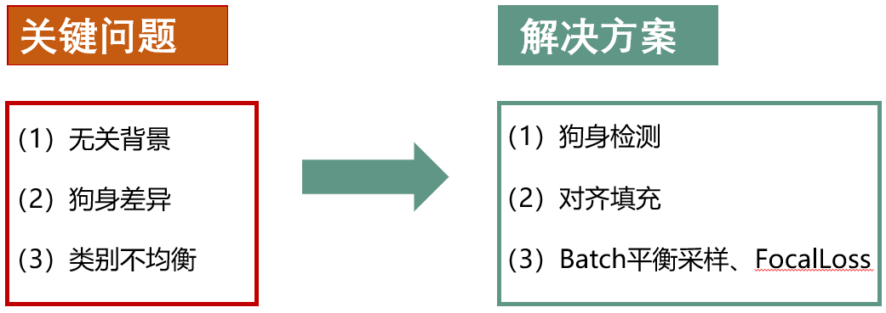
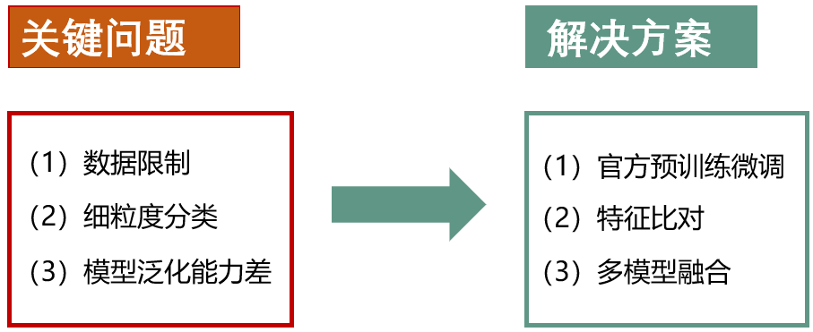

# JittorDogsClass

#### 收录到[PytorchNetHub](https://github.com/bobo0810/PytorchNetHub)

- 正在整理代码

- 总排名第4，获得三等奖

  > A榜第8，B榜第7（三支队伍代码审核未过，故晋级第4）

## 解决方案

> 答辩PPT位于`files/`
>

- 数据集



- 训练策略



## 数据集

目前世界上最大的狗细分类数据集Tsinghua Dogs，包含130个品种，总计70428张图（每张图仅包含一只狗）。

[比赛官网](https://www.educoder.net/competitions/index/Jittor-2) 

**训练集：**[High resolution images](https://cg.cs.tsinghua.edu.cn/ThuDogs/)   (38.8GB)

> 注：狗身bbox标注已保存于dataset/all_imgs.txt，无需下载。

**测试集：**

|      | 官方                                                         | 已裁剪狗身                                                   |
| ---- | ------------------------------------------------------------ | ------------------------------------------------------------ |
| A榜  | [Link](https://pan.baidu.com/s/1F5Rq9C1BOKH-0ryz2rYN8w)   提取码gc2y | [Link ](https://pan.baidu.com/s/1mg-xjFL1p9n5LGgg9qQ1gQ)  提取码ffem |
| B榜  | [Link](https://pan.baidu.com/s/1mYDTTZvTVJ7MoOtMQ0byWg)   提取码3v73 | [Link](https://pan.baidu.com/s/1n3hkC5EKqGcVoGmkRSsLfA)   提取码zb9b |

## 运行

```shell
python==3.7.10
jittor==1.2.2.47
visualdl==2.1.1
pyyaml==5.4.1
albumentations==0.5.2
```

### 训练

1. 配置参数

   - 配置参数：`config/train.yaml`

   - 配置训练集：`dataset/data_conf.yaml` 配置`Train/default` ，值为 `high-resolution解压路径`。

2. 运行

   ```shell
   # 命令行
   CUDA_VISIBLE_DEVICES=0  python train.py 
   ```

3. 可视化

   ```shell
   # 命令行
   visualdl  --logdir log路径   --host IP地址  --port 端口号
   
   举例: visualdl  --logdir  /home/../tb_log/2021-04-26_10:43:58_ip115   --host 192.168.1.115  --port 8988
   ```

### 测试

1. 配置参数
   - 配置参数：`config/test.yaml`
   - 配置测试集： `dataset/data_conf.yaml` 配置`Test/Body/default` ，值为 `A榜/B榜已裁剪狗身测试集解压路径`。

2. 运行

   ```shell
   # 命令行
   CUDA_VISIBLE_DEVICES=0  python test.py 
   ```

3. 生成预测结果`result.json`

### 模型融合

1. 配置多模型参数  `config/fusion.yaml`

2. 运行

   ```shell
   # 命令行
   CUDA_VISIBLE_DEVICES=0  python fusion.py 
   ```

3. 生成预测结果`fusion.json`

### 预训练

| model        | pretrain        | img_size  | A榜    |
| ------------ | --------------- | --------- | ------ |
| ResNeXt50    | model_7.pkl     | [368,368] | 65.35% |
| ResNeXt50    | model_11.pkl    | [420,420] | 65.42% |
| ResNeXt50    | model_6.pkl     | [420,420] | 65.48% |
| ResNeXt101   | model_8.pkl     | [368,368] | 65.35% |
| EcaResNet50t | model_7_new.pkl | [420,420] |        |

注：[预训练权重下载](https://pan.baidu.com/s/11datrjvWpepZ3Q9ab2U83A)  提取码5w1z

> A榜:   model_7.pkl + model_11.pkl + model_6.pkl =  66.62%
>
> B榜：model_7.pkl + model_11.pkl + model_6.pkl + model_8.pkl + model_7_new.pkl =  64.58%

------

**特别鸣谢**

- 支金林：狗身检测

- 刘江宽：Batch平衡采样
- 石园：SAM优化器（移植Jittor）